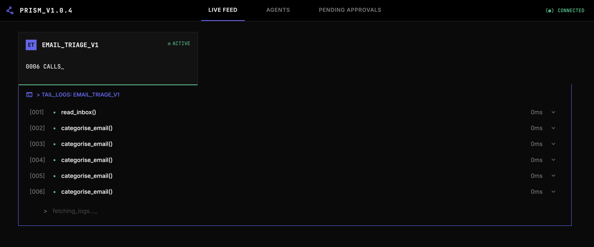
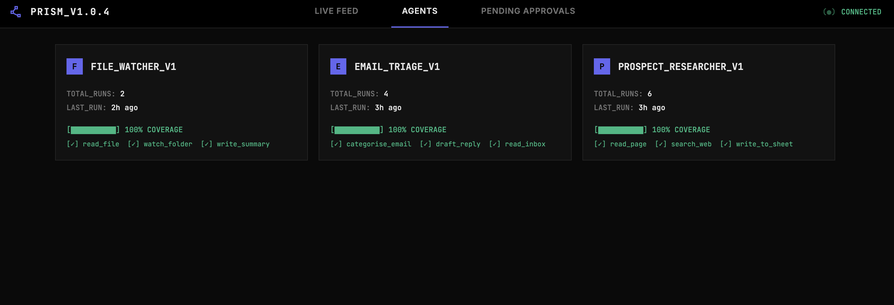
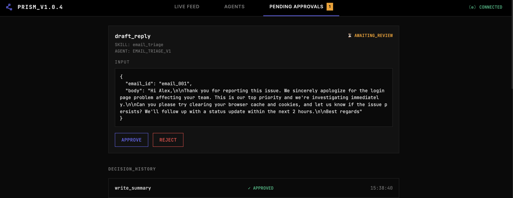
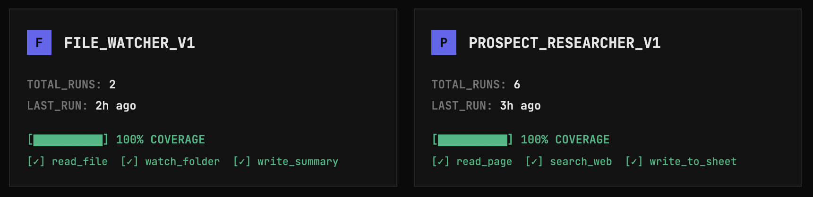

# Prism


**Don't let agents act blindly.**

Prism is a local-first oversight SDK for Python agents that write, send, or execute. It tells you what consequential tools your agent can call that you are not properly governing, pauses execution and asks for human approval before risky tool calls run, and surfaces every tool call live through a local web UI. It works with any Python agent: LangChain, raw Anthropic API, CrewAI, or a custom loop. Two lines of code per tool, zero changes to your existing logic.

## The Problem

AI agents are increasingly doing things that have real consequences: searching the web, writing files, sending emails, making API calls, modifying data. But most agents operate as black boxes. The person who triggered the agent has no way to see what it's doing while it runs, no way to intervene before something goes wrong, and no structured record of what happened after the fact. If you've ever run an agent, waited for it to finish, and then had to guess what it actually did, or worse, discovered it did something you didn't want, that's the problem Prism exists to solve.

Prism changes the contract from *"I'll give you a task and hope you do it right"* to *"I'll know what you're doing at all times, I can redirect you mid-flight, and I have a complete record of every decision you made."*

The shorter name for that is **controlled autonomy**. Your agent stays useful, you keep the final say on anything consequential.

<!-- screenshot -->
*The Prism UI showing three agents in the Live Feed with one pending approval.*

## What Prism Does

Three things, in this order:

**1. Tells you what your agent can do that you are not properly governing.** Most agent tools answer "did my agent call the right thing?" Prism asks the question other tools do not: of all the consequential things your agent can do, which ones are properly gated for their risk level, and which are not? Today the answer is at the instrumentation level (which tools are wrapped with `@prism.watch`). The roadmap evolves it toward governance coverage proper, where read-only tools are complete when watched and write, send, exec, or delete tools are incomplete unless also gated.

**2. Pauses execution and asks for human approval before consequential tool calls run.** The agent stops, the tool call surfaces in the UI with full context (tool name, inputs, agent ID, skill), and a human approves or rejects. Approval resumes execution. Rejection raises a `PermissionError` the agent loop catches and continues from. Decisions are recorded.

**3. Shows every tool call live through a local web UI.** Watch agent activity as it happens, review past runs, and audit decisions. No external connections, no auth, no database. Data stays on your machine.

## Installation

Requires Python 3.9 or higher.

```bash
git clone https://github.com/musi27/prism.git
cd prism
python3 -m venv venv
source venv/bin/activate
# On Windows: venv\Scripts\activate
pip install -r requirements.txt
```

Start the UI:

```bash
python3 serve.py
```

Then open `http://localhost:4242` in your browser.

To bind a different host or port, pass `--host` / `--port`, or set `PRISM_UI_HOST` / `PRISM_UI_PORT`. The same env vars are read by the SDK, so a single `export PRISM_UI_PORT=5050` reaches both the UI server and any agents started in the same shell.

Three working example agents are included in `agent/` if you want to see Prism running before integrating it into your own code. You'll need an Anthropic API key. Set it with `export ANTHROPIC_API_KEY=sk-ant-your-key-here` before running any agent.

## Agent Integration

Prism instruments at the tool layer, the point where agents interact with the world. This is framework-agnostic by design: it doesn't matter whether your agent runs on LangChain, the raw Anthropic API, CrewAI, or a custom loop. If it calls tool functions, Prism can watch them.

Two core primitives:

### `@prism.watch`

A decorator you put on any tool function. It wraps the function so that every time it's called, Prism automatically records the inputs, outputs, duration, and success/failure, without changing what the function does. Your tool code stays exactly the same.

```python
import prism

@prism.watch
def fetch_data(query):
    # your existing code (unchanged)
    ...

@prism.watch
def process_result(data):
    ...
```

The optional `skill` parameter groups related tool calls under a named workflow, making logs easier to read when an agent has many tools across distinct phases.

```python
@prism.watch(skill="reporting")
def save_output(filename, content):
    ...
```

Every call to `save_output` will be tagged with `skill_context: "reporting"` in the logs and UI, so you can see at a glance which phase of the agent's work each tool call belongs to.

### `prism.configure()`

Called once at startup, before the agent starts running. Tells Prism which agent is running, where to write logs, which tools need human approval, and what the full tool list is. It also starts the background heartbeat and registers shutdown hooks so everything cleans up automatically when the process exits.

```python
prism.configure(
    agent_id="my-agent-v1",
    log_path="./logs",
    require_approval_for=["save_output"],
    tools=["fetch_data", "process_result", "save_output"],
)
```

**`agent_id`**: a name for this agent, used to group runs in the UI and logs. Pick something descriptive.

**`log_path`**: where log files are written. Defaults to `./logs`.

**`require_approval_for`**: list of tool names that need human sign-off before executing. Optional.

**`tools`**: the full list of tool names the agent has. Used for the coverage report. If your agent uses LangChain, Prism auto-detects this and you can omit it. For the raw Anthropic API or other frameworks, pass it explicitly.

### Putting it together

Here's what a fully instrumented agent file looks like after adding Prism:

```python
import prism

# Step 1: decorate each tool function
@prism.watch
def fetch_data(query):
    # your existing code (unchanged)
    ...

@prism.watch
def process_result(data):
    ...

@prism.watch(skill="reporting")
def save_output(filename, content):
    ...

# Step 2: configure once at startup
prism.configure(
    agent_id="my-agent-v1",
    log_path="./logs",
    require_approval_for=["save_output"],
    tools=["fetch_data", "process_result", "save_output"],
)

# Step 3: run your agent as normal. Nothing else changes.
run_my_agent()
```

That's the full integration. Everything else is automatic.

## What Happens Automatically

Once `@prism.watch` and `prism.configure()` are in place:

- Every tool call is logged to a structured JSON file in `logs/` with timestamps, inputs, outputs, duration, and status
- The Live Feed in the UI updates in real time as tool calls happen
- A heartbeat runs in the background so the UI knows whether the agent is active, idle, or crashed
- When the agent finishes, a coverage report runs automatically showing which tools are properly governed for their risk level and which are not
- The completion signal is sent to the UI automatically, with no manual call needed
- Log files rotate when they exceed 10,000 entries or 10MB

This works for both on-demand agents (run once and finish) and continuous agents (run indefinitely until stopped). On-demand agents complete automatically when the process exits. Continuous agents stay active in the Live Feed indefinitely and send their completion signal when stopped with Ctrl+C.

## The UI

Open the UI URL printed when you start `python3 serve.py` — by default `http://localhost:4242`. The UI has three views:

**Live Feed.** Shows agents that are currently running, each as a tile with its name, status (active, idle, or complete), and a live tool call count. Click a tile to see the last 50 tool calls as they happen. When an agent finishes, its tile disappears.



**Agents.** A tile for every agent that has ever run, showing total runs, last run time, health status, and coverage. Click a tile to see all runs for that agent. Click a run to see every tool call in order, with expandable inputs and outputs.



**Pending Approvals.** When a tool is flagged as requiring human sign-off, it appears here before it executes. You see what tool is about to be called, with what inputs, and which agent is requesting it. See the [Approval Flow](#approval-flow) section below for the full mechanics.



## Approval Flow

Some tool calls have real consequences: sending an email, deleting a file, writing to a database. Logging those after the fact isn't enough. The approval flow lets a human see what's about to happen and decide whether it should proceed.

Any tool listed in `require_approval_for` pauses before executing:

1. The agent stops and waits
2. The tool appears in the Pending Approvals tab with full context: tool name, inputs, agent ID, and skill (if set)
3. A reviewer clicks Approve or Reject
4. If approved, the tool executes and the agent continues
5. If rejected, the SDK raises a `PermissionError`. The agent's tool call loop catches this as an error and continues to the next step. The tool is not executed and the rejection is logged.


*The Pending Approvals tab showing a tool call awaiting human review.*

If the UI is not running, the SDK falls back to a `y/n` prompt in the terminal.

All approval decisions, both approvals and rejections, are recorded in the Decision History section of the Pending Approvals tab.

## Coverage

Most agent tools answer "did my agent call the right thing?" Prism answers a question they do not: "what can my agent do that I'm not watching?"

That question is what makes Prism trustworthy rather than aspirational. It doesn't just log the tools you remembered to instrument; it tells you which tools you missed. Runtime SDKs cannot answer this by construction, because they only see what you wired up. Observability platforms don't ask it.

Today, that question is answered at the instrumentation level. When an agent finishes, Prism compares the tools wrapped with `@prism.watch` against the full tool list (auto-detected for LangChain, declared for raw API). The result is a concrete, measurable coverage report, like code coverage but for agent oversight.

The roadmap evolves this toward governance coverage proper: read-only tools are complete when watched, write, send, exec, and delete tools are incomplete unless also gated. A logged-but-ungated write tool will read as incomplete coverage, not a green checkmark. Today's report is the foundation; the question is the same.

In the UI, each agent tile in the Agents tab shows a coverage percentage with a colour-coded bar: green at 100%, yellow between 70-99%, red below 70%. Click into a run to see the full per-tool breakdown with checkmarks and crosses.


*The Agents tab showing coverage percentages and per-tool breakdowns on each tile.*

The same report prints to the terminal automatically when the agent exits:

```
Prism Coverage Report: my-agent-v1
------------------------------------------------
Instrumented:   3 / 3 tools (100%)

  [✓] fetch_data
  [✓] process_result
  [✓] save_output

No gaps detected.
```

If a tool is missing:

```
  [✗] save_output   ← not instrumented
```

A warning badge also appears on the agent tile in the UI.

## Log Schema

Every tool call produces a JSON log entry:

```json
{
  "agent_id": "my-agent-v1",
  "run_id": "run_20240408_001",
  "timestamp_start": "2024-04-08T10:23:11Z",
  "timestamp_end": "2024-04-08T10:23:14Z",
  "duration_ms": 3012,
  "tool_name": "fetch_data",
  "skill_context": null,
  "inputs": { "query": "example input" },
  "outputs": { "results": ["..."] },
  "status": "success",
  "error": null
}
```

- **agent_id**: unique identifier for the agent instance
- **run_id**: unique identifier for this execution run
- **timestamp_start**: when the tool call began (ISO 8601)
- **timestamp_end**: when the tool call completed (ISO 8601)
- **duration_ms**: how long the call took in milliseconds
- **tool_name**: name of the tool that was called
- **skill_context**: optional name of the higher-level skill this tool call belongs to
- **inputs**: the arguments passed to the tool
- **outputs**: the return value of the tool
- **status**: `success` or `failure`
- **error**: error message if the call failed, `null` otherwise

Log files are written to `logs/` as JSONL (one entry per line) and rotate automatically.

## Today and Tomorrow

These are deliberate deferrals, not oversights:

- Long-term memory observation
- Agent state capture
- Multi-agent and orchestration oversight
- Support for languages other than Python

Today Prism runs on a single machine. The durable identity is data sovereignty: your agent's logs, approvals, and run history stay on infrastructure you control. Self-hostable aggregation across machines (so the reviewer can be on a different device than the agent, and production agents don't have to run on a laptop) is on the roadmap. A Prism-hosted SaaS is not.

## Contributing

Found a bug or want to suggest a feature? [Open an issue](https://github.com/musi27/prism/issues) on GitHub.

To contribute code, fork the repo, create a branch, and submit a pull request. Keep changes focused: one PR per feature or fix.

To test changes locally, activate the venv, start the UI with `python3 serve.py`, and run any of the example agents in `agent/` to verify end-to-end behaviour.

Please be respectful and constructive in all interactions.

## License

MIT License
